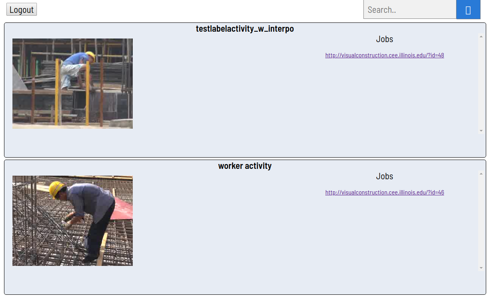
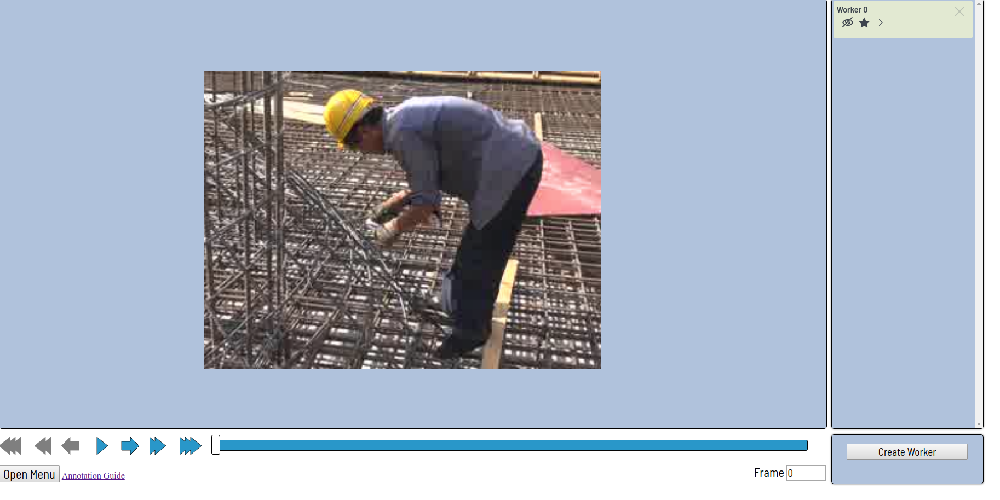
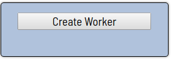
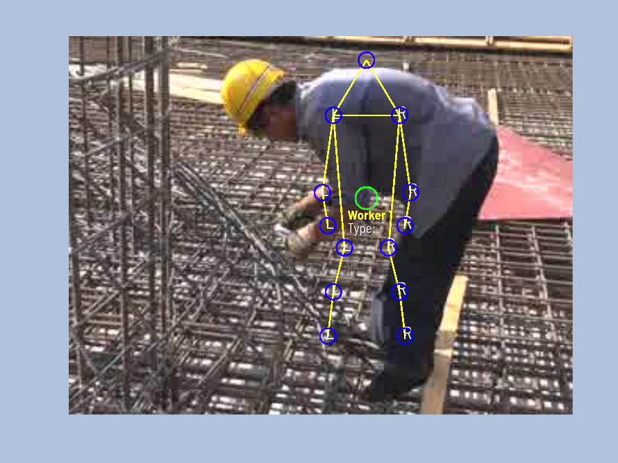

# CEE 320 Worker keypoint annotation tool - User's Guide

## Getting started

### Accesing annotation interface

- Send TA an email indicating you would like to take this assignment, we will create a account for you using your UID and a randomly generated passward, you may change the passward after your first login. After we create your account you will then be able to log in at [visual construction website](visualconstruction.cee.illinois.edu):

   

- The TAs will assign annotation tasks to you. Once this is done, you will have access to the task when you log in. Click on the hyperlink under the "Jobs" column on the right side of the screen to start annotating. 

   

### Grading quiteria

- Your final score of this bounuce assignment will be determined both by your annotation number and quality. Please take a look at sample annotations and annotation best practices carefully.

- By registering to this assignment you automatically get 20% credit of this assignment.
- You will be automatically assigned with a number of annotation tasks, when your annotation results are approved, you will received 40% credit.
- When you finish the first batch, you will receive the second batch of annotation tasks, and the rest of credit will as given after your annotations are approved. 

### Basic navigation to the interface
0. An example of annotation landing page is shown as below.

    

1. Use arrows below to move on next/previous frame. To see the keyboard shortcut, hover your mouse pointer over an UI element (D and F keys for left and right respectively).

    

2. An image can be zoomed in/out using the mouse wheel. The image will be zoomed relative to your current cursor position. Thus if you point on an object it will be under your mouse during zooming process.

3. An image can be moved/shifted by clicking/dragging the image.

### How to annotate
0. All workers presented in the video clip should be annotated, however if you only see a hand or workers' body are mostly outside of video , you can omit them. If you are not sure, send us your user name and job link, we will let you know.

1. Create a worker by pushing the "Create Worker" button on the bottom right of the screen. Until your next click, moving your cursor over the image will move the construction worker skeleton. Upon your next click, you will create a worker. **Important note:** by convention, we define the *left side* of a worker as corresponding to the left side of a worker as viewed from behind. To **flip left/right worker keypoints**, press ``Ctrl`` **before** you place the worker.

    
       
2. Initilize and  modify skeleton keypoint positions:
   - A skeleton will be initilzied like in the following example after step 1:
    

   - To modify an *individual* keypoint's position, just click and drag the corresponding keypoint. 
     The position of the green "Center" keypoint automatically shifts to the centroid of the smallest bounding box encompassing all keypoints. Therefore, if moving an individual keypoint changes this bounding box, the green "Center" keypoint will shift slightly.
   - To modify *all* keypoints' positions, click and drag the green "Center" keypoint.
   - **Interpolating keypoints**:
      - If you modify a keypoint on frame n, frame n will become a *key frame* for that keypoint's skeleton. Frame 0 is always a keyframe for all skeletons.
      - When a key frame is created, all keypoint positions will be linearly interpolated between the previous keypoint's frame and the new key frame.
      - This means that **if a keypoint's motion from frame n to frame m is linear, to annotate this keypoint, you therefore only have to annotate frames n and frames m - not the frames inbetween**. With this technique you should be able to save a lot of annotation time.
     
4. To modify skeleton keypoint visibilities:
   - Individual keypoint visibility can be either modified by
      - Moving your cursor upon the keypoint you want to change visibility status, then press 's' on the keyboard, an occulded keypoint will be shown by dash line circle. For more hot-key binding option, plese lick on "Open Menu" -> "Help" on the buttom left of the page.
      - Clicking on the chevron in the corresponding worker's box in the panel on the right side of the page. A list of keypoints drops down with corresponding visibility icons. Click on the keypoint's visibility icon to occlude it (the corresponding keypoint circle will now appear with a dashed boundary). Click on the icon again to render it visible.
      - **Interpolation behavior**:
         - When a keypoint's visibility is changed, this frame becomes a keyframe for the skeleton. The visibility of all keypoints are constant for all frames up until the next keyframe (when the keypoint's visibility changes to its visibility on that frame).
         

5. When an annotated worker disappears from the screen, you need to finish the track. To do that you need to click on the "Outsided Property" icon ( the eye icon under each worker's label). The skeleton will then disappear on that frame, and its corresponding box on the panel on the right side of the page will disappear on all subsequent frames. **Note**: the skeleton will reappear when rewinding to frames before the track finishes.
    
### Best annotation practice
   We recommend using our strategy for annotating body keypoints.
   - Step 1: annotate on the first frame, then forward to 10 frames later, adjust the keypoints if necessary. Keeping forwarding and adjusting till the end of video.
   - Step 2: replay the clip and see if anywhere goes wrong by keypoint interpolation.
   - Step 3: go to the 3'th frame, adjust the key points if necessary, then forward to 10 frames later (the 13'th frames of clip), repeat adjustment process in step 1 till the end of clip.
   - Step 4: repeat step2 and step3, each time you can start with a few frames further and skip by 10 frames to adjust keypoint interpolation results, when you are confident about the entire annotation, use "Open Menu" -> "Save Work" to save your annotation results.

### Vocabulary

---
**Annotation** is a set of bounding boxes and tracks. There are several types of annotations:
- *Manual* which is created by a person
- *Semi-automatic* which is created automatically but modified by a person
- *Automatic* which is created automatically without a person in the loop
---
### Navigation by frames/images

---
Go to the next/previous frame with a predefined step. Shortcuts: ``v`` — step backward, ``c`` — step forward. By default the step is ``10``.

To change the predefined step go to settings (``Open Menu`` —> ``Settings``) and modify ``Player Step`` property.

### Open Menu
It is the main menu for the annotation tool. You can use it to remove all existing annotations, to change player settings and to save your existing work.

### Settings

The menu contains different parameters which can be adjust by the user needs. For example,``Player Step``, ``Player Speed``.

 - ``Brightness`` makes it appear that there is more or less light within the image.
 - ``Contrast`` controls the difference between dark and light parts of the image
 - ``Saturation`` takes away all color or enhance the color.
